# MOBLUX OS — Domain Model

Purpose: proposed entities and relationships for the cumulative specifications. This is a conceptual model, not an approved migration or a requirement to build all entities in phase 1. Business policies marked unresolved must be settled before affected functionality ships.

## Project, version and release

- Project is the canonical business identity, connected to customer, origin/design inputs and operational metadata. Human-readable numbering is separate from internal stable identity; paths are never IDs.
- ProjectVersion belongs to exactly one Project and freezes published design data and source/derived asset references. Import staging is separate. Room/Cabinet/Part identities are version-scoped; source IDs do not prove cross-version identity.
- ProductionRelease belongs to the same Project and one exact immutable version. It freezes the manufacturing manifest, requirement revision and gate evidence. Later design changes never alter active releases. Relationships permit release history but do not authorize partial/concurrent releases without Q7.
- ProductionOrder is release-scoped execution work, distinct from Project and commercial Order. Splitting rules remain deferred.
- ApprovalEvent and CustomerAcceptance are immutable evidence. APPROVED in the first slice means customer approval of exactly one ProjectVersion and never ProductionRelease authorization. ApprovalEvent preserves exact approved references/snapshots rather than resolving latest at read time. Corrections/retractions, if permitted, create new evidence rather than rewriting history.

Use exact asset revision IDs/hashes, never latest-file pointers. Preserve historical material descriptions, dimensions and commercial values when catalog data changes. Money is decimal plus currency; quantity is decimal plus unit. Record UTC event timestamps, display configured local time, and validate enumerated states and transitions.

## Entities and module ownership

| Owner | Entities and relationships |
| --- | --- |
| Identity/access | User, Role, Permission, RoleGrant, UserOverride, ProjectAccess, Session; customer users map explicitly to CustomerContact, staff to assignments/scopes |
| Customers | Customer has contacts and projects; architect/designer/sketch/measurement input is not automatically manufacturing-verified |
| Projects | Project has ProjectVersions and DesignInputs; TechnicalValidation references exact version/evidence; version contains Rooms, Cabinets, Parts, Edges, MachiningOperations, HardwareRequirements and Accessories |
| Import | ImportBatch has immutable source assets, ImportAttempts, adapter/profile version, ValidationFindings and NormalizedStaging; successful publication produces a version with per-record provenance |
| Catalog | CatalogItem, Material, HardwareItem, Unit, Supplier, SupplierOffer and PriceHistory; offers hold supplier code, packaging multiple and lead time; ProcurementMode includes STOCK_ITEM, PROJECT_PURCHASE, ORDER_PER_PROJECT, AD_HOC; CONSIGNMENT remains future |
| Assets/documents | Asset and immutable AssetRevision; Document may exist at Project level and links customer, type, revision and creation date; version-sensitive records explicitly identify ProjectVersion; ModelArtifact links source/conversion output; ManufacturingFile links purpose, source and exact part/cabinet/version/release where applicable |
| Approvals | ApprovalRequest identifies category, version and presented artifact/quotation revisions; ApprovalEvent records customer, actor, state, timestamp and snapshot reference |
| Commercial | Each immutable QuotationRevision explicitly references the ProjectVersion for which it was prepared; version-sensitive commercial records retain this ancestry; CommercialOrder references agreed proposal; CostEstimate/CostLine compare markup and actual cost with frozen assumptions, never fixed coefficients |
| Finance | Project-specific PaymentPlan with versioned PaymentMilestones/triggers defines the release payment condition; no fixed 50% rule; support 70/30, 40/40/20 and custom milestones. ReleaseGateEvidence references exact applicable configuration and payment evidence. PaymentRecord/PaymentAllocation support partial or combined payments; InvoiceReference stores external ID/status and project link; reconciliation evidence is separate from customer assertions |
| Production | ReleaseGateEvidence identifies approvals, payment conditions, validation and requirements; ReleaseOverride records failed checks/reason/actor/time; ProductionOrder has ProductionOperations, internal/external ProductionProvider, Workstation and future OperationTimeEvents |
| Inventory/purchasing | MaterialRequirementSet/lines reference source version and, when released, frozen release. Preliminary Reservation/StockAllocation explicitly links Project and source basis, item, quantity/location, authorization and audit; ProductionRelease is optional before release. PurchaseOrder/lines and RequirementAllocation preserve project/source links even for preliminary or consolidated purchases. Later release allocation retains preliminary history and requires authorization; no implicit production authorization. StockMovement records receipt/consumption/adjustment; GoodsReceipt links purchases/processing to stock changes |
| External processing | ExternalProcessingOrder links provider, release and operations, with dispatch/receipt evidence; routing can move from external to internal without changing version geometry |
| Assembly/QC | AssemblyRecord/checklist/photos references release cabinet; QCInspection is separate with factory/site context, checklist revision and result; NonConformity stores category, description, responsible stage when known, reporter/time/photos/resolution and part/cabinet linkage; rework and recheck remain traceable |
| Installation | InstallationOrder links Project and ProductionRelease; tasks/checklists target project/room/cabinet; Delivery/Transport connects release to installation; InstallationCompletion is distinct from QC and CustomerAcceptance; CustomerIssue links project/installation and evidence |
| After-sales | WarrantyRecord links project, accepted version, installation, acceptance date, start, duration and documents; future ServiceTicket references warranty/project; feedback/review invitations are independent of warranty rights |
| Audit/communications/AI | AuditEvent links actor/time/entity and applicable project/version/release with safe before/after evidence; NotificationDelivery records outcome; AIProposal records inputs, proposed action and validation/approval evidence |

Production owns frozen requirement evidence in the release; Purchasing owns procurement planning; Inventory owns stock commitments. Catalog owns current master data; versions and commercial revisions own historical snapshots. Read models combine these without becoming competing sources of truth.

## Initial conceptual ER model

Selected relationships only; this is not exhaustive DDL. Cardinalities express capacity for history, not approved release-splitting policy. Downstream project references must agree with their version/release ancestry.

```mermaid
erDiagram
    Customer ||--o{ Project : owns
    Customer ||--o{ CustomerContact : has
    CustomerContact ||--o{ ProjectAccess : receives
    Project ||--o{ ProjectAccess : grants
    Project ||--o{ DesignInput : collects
    Project ||--o{ ImportBatch : imports
    ImportBatch ||--o{ ImportAttempt : retries
    ImportBatch ||--o{ ImportSource : preserves
    AssetRevision ||--o{ ImportSource : identifies
    Project ||--o{ ProjectVersion : versions
    ImportAttempt o|--o| ProjectVersion : publishes
    ProjectVersion ||--o{ Room : contains
    Room ||--o{ Cabinet : contains
    Cabinet ||--o{ Part : contains
    Part ||--o{ Edge : has
    Part ||--o{ MachiningOperation : describes
    ProjectVersion ||--o{ HardwareRequirement : requires
    CatalogItem o|--o{ Part : resolves_material
    CatalogItem o|--o{ HardwareRequirement : resolves_item
    ProjectVersion ||--o{ VersionAsset : freezes
    AssetRevision ||--o{ VersionAsset : supplies
    ProjectVersion ||--o{ ApprovalEvent : approved_by
    ProjectVersion ||--o{ TechnicalValidation : verified_by
    ProjectVersion ||--o{ QuotationRevision : priced_by
    QuotationRevision ||--o{ CommercialOrder : agreed_by
    Project ||--o{ PaymentPlan : has_history
    PaymentPlan ||--|{ PaymentMilestone : defines
    PaymentMilestone ||--o{ PaymentAllocation : credited_by
    PaymentRecord ||--o{ PaymentAllocation : allocates
    Project ||--o{ PaymentRecord : receives
    Project ||--o{ InvoiceReference : billed_by
    InvoiceReference o|--o{ PaymentAllocation : reconciles
    ProjectVersion ||--o{ ProductionRelease : freezes
    ProductionRelease ||--|{ ReleaseGateEvidence : proves
    ProductionRelease ||--o{ ReleaseOverride : records
    ProjectVersion ||--o{ MaterialRequirementSet : requires
    ProductionRelease o|--|| MaterialRequirementSet : freezes
    MaterialRequirementSet ||--|{ MaterialRequirement : contains
    Project ||--o{ Reservation : owns
    ProductionRelease o|--o{ Reservation : allocates
    CatalogItem ||--o{ Reservation : reserves
    CatalogItem ||--o{ StockMovement : moves
    Supplier ||--o{ SupplierOffer : offers
    CatalogItem ||--o{ SupplierOffer : sourced_by
    Supplier ||--o{ PurchaseOrder : receives
    PurchaseOrder ||--|{ PurchaseOrderLine : contains
    PurchaseOrderLine ||--o{ RequirementAllocation : fulfils
    MaterialRequirement ||--o{ RequirementAllocation : sourced_by
    PurchaseOrderLine ||--o{ GoodsReceiptLine : received_as
    ProductionRelease ||--o{ ProductionOrder : executes
    ProductionOrder ||--|{ ProductionOperation : routes
    ProductionProvider ||--o{ ProductionOperation : performs
    ProductionRelease ||--o{ ExternalProcessingOrder : outsources
    ProductionProvider ||--o{ ExternalProcessingOrder : receives
    ProductionOperation ||--o{ OperationTimeEvent : times
    ProductionRelease ||--o{ AssemblyRecord : assembles
    ProductionRelease ||--o{ QCInspection : inspected_by
    QCInspection ||--o{ NonConformity : finds
    ProductionRelease ||--o{ InstallationOrder : installs
    InstallationOrder ||--o{ QCInspection : site_inspection
    InstallationOrder ||--o{ CustomerIssue : reports
    InstallationOrder ||--o{ CustomerAcceptance : accepted_by
    ProjectVersion ||--o{ CustomerAcceptance : identifies
    ProductionRelease ||--o{ CustomerAcceptance : identifies
    CustomerAcceptance ||--o{ WarrantyRecord : supports
    Project ||--o{ Document : documents
    Document ||--|{ AssetRevision : revises
    Project ||--o{ AuditEvent : traces
```

## Integrity and lifecycle

TechnicalValidation proves manufacturing verification; a source filename or designer dimension does not. A published version cannot be edited to fix import errors. Project-level documents may be added separately; later version-sensitive records explicitly reference the applicable immutable version without rewriting its design manifest or prior approval. QuotationRevision and ApprovalEvent never rely on latest pointers. Approval is reconstructed from its saved references/snapshots.

Preliminary procurement/reservations may exist without ProductionRelease and must retain project/source basis, permission and audit evidence. They never authorize production; financially consequential actions use explicit controls. Allocation/reconciliation and cancellation details remain Q6/Q7 rather than invented rules. A release checks the configured PaymentPlan/PaymentMilestone condition, not a universal advance percentage; preserve configuration history with gate evidence.

Release creation freezes gate evidence in one authorized concurrency-safe use case. Operator progress changes execution records, not snapshot content. Assembly completion never grants QC approval; installation completion never implies acceptance. Customer issues keep the project open. Acceptance may trigger a configured payment milestone; warranty follows agreed completion rules and never depends on public reviews. Retention/deletion cannot break release/audit traceability; Q9 governs live-data retention.

Do not fabricate missing source grouping, cross-version identity, conversion factors, payment percentages, markups or warranty durations. Unknown grouping remains unresolved in staging until an adapter mapping is validated.
