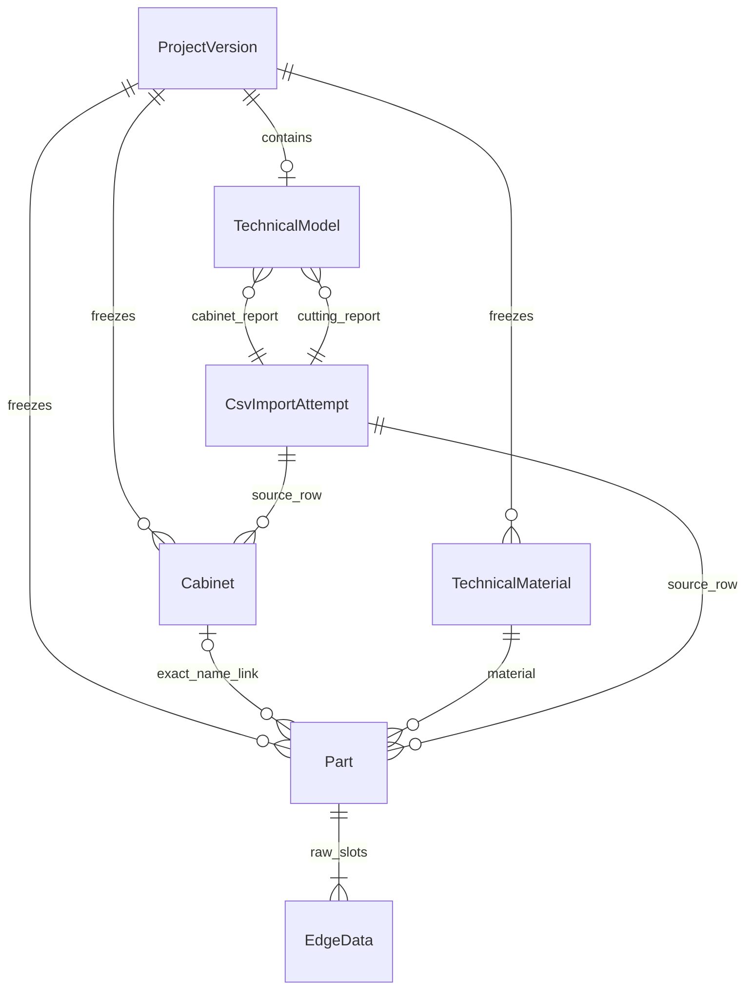
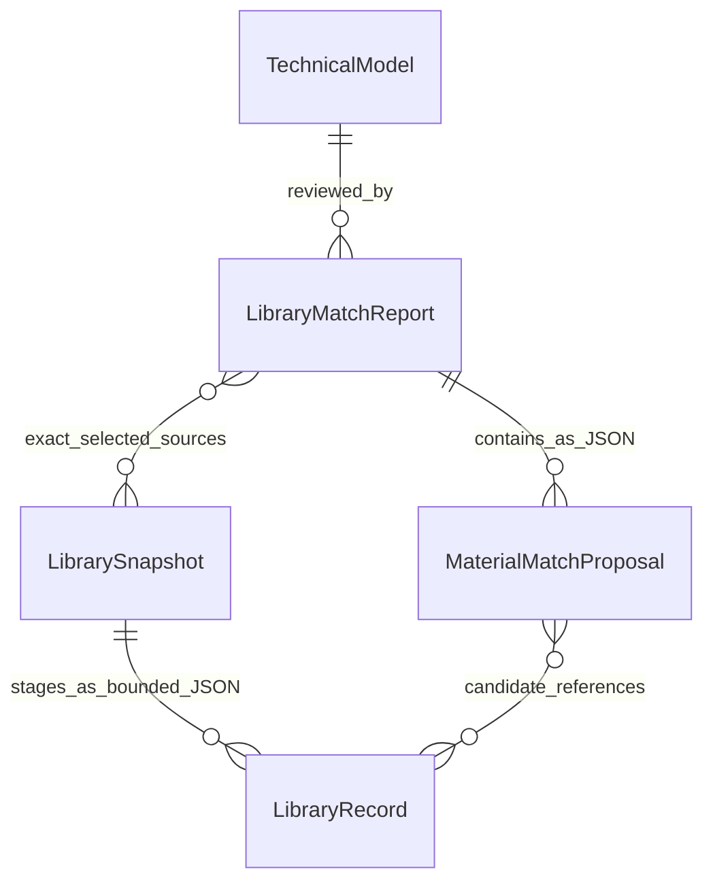
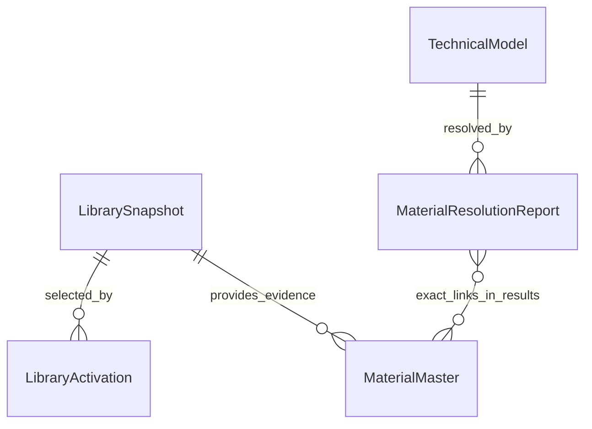

# MOBLUX OS — Domain Model

Purpose: proposed entities and relationships for the cumulative specifications. This is a conceptual model, not an approved migration or a requirement to build all entities in phase 1. Business policies marked unresolved must be settled before affected functionality ships.

## Project, version and release

- Project is the canonical business identity, connected to customer, origin/design inputs and operational metadata. Human-readable numbering is separate from internal stable identity; paths are never IDs.
- ProjectVersion belongs to exactly one Project and freezes published design data and source/derived asset references. Import staging is separate. Room/Cabinet/Part identities are version-scoped; source IDs do not prove cross-version identity.
- ProductionRelease belongs to the same Project and one exact immutable version. It freezes the manufacturing manifest, requirement revision and gate evidence. Later design changes never alter active releases. Relationships permit release history but do not authorize partial/concurrent releases without Q7.
- ProductionOrder is release-scoped execution work, distinct from Project and commercial Order. Splitting rules remain deferred.
- ApprovalEvent and CustomerAcceptance are immutable evidence. APPROVED in the first slice means customer approval of exactly one ProjectVersion and never ProductionRelease authorization. ApprovalEvent preserves exact approved references/snapshots rather than resolving latest at read time. Corrections/retractions, if permitted, create new evidence rather than rewriting history.

Use exact asset revision IDs/hashes, never latest-file pointers. Preserve historical material descriptions, dimensions and commercial values when catalog data changes. Money is decimal plus currency; quantity is decimal plus unit. Record UTC event timestamps, display configured local time, and validate enumerated states and transitions.

## Entities and module ownership

| Owner | Entities and relationships |
| --- | --- |
| Identity/access | User, Role, Permission, RoleGrant, UserOverride, ProjectAccess, Session; customer users map explicitly to CustomerContact, staff to assignments/scopes |
| Customers | Customer has contacts and projects; architect/designer/sketch/measurement input is not automatically manufacturing-verified |
| Projects | Project has ProjectVersions and DesignInputs; TechnicalValidation references exact version/evidence; version contains Rooms, Cabinets, Parts, Edges, MachiningOperations, HardwareRequirements and Accessories |
| Import | ImportBatch has immutable source assets, ImportAttempts, adapter/profile version, ValidationFindings and NormalizedStaging; successful publication produces a version with per-record provenance |
| Catalog | CatalogItem, Material, HardwareItem, Unit, Supplier, SupplierOffer and PriceHistory; offers hold supplier code, packaging multiple and lead time; ProcurementMode includes STOCK_ITEM, PROJECT_PURCHASE, ORDER_PER_PROJECT, AD_HOC; CONSIGNMENT remains future |
| Assets/documents | Asset and immutable AssetRevision; Document may exist at Project level and links customer, type, revision and creation date; version-sensitive records explicitly identify ProjectVersion; ModelArtifact links source/conversion output; ManufacturingFile links purpose, source and exact part/cabinet/version/release where applicable |
| Approvals | ApprovalRequest identifies category, version and presented artifact/quotation revisions; ApprovalEvent records customer, actor, state, timestamp and snapshot reference |
| Commercial | Each immutable QuotationRevision explicitly references the ProjectVersion for which it was prepared; version-sensitive commercial records retain this ancestry; CommercialOrder references agreed proposal; CostEstimate/CostLine compare markup and actual cost with frozen assumptions, never fixed coefficients |
| Finance | Project-specific PaymentPlan with versioned PaymentMilestones/triggers defines the release payment condition; no fixed 50% rule; support 70/30, 40/40/20 and custom milestones. ReleaseGateEvidence references exact applicable configuration and payment evidence. PaymentRecord/PaymentAllocation support partial or combined payments; InvoiceReference stores external ID/status and project link; reconciliation evidence is separate from customer assertions |
| Production | ReleaseGateEvidence identifies approvals, payment conditions, validation and requirements; ReleaseOverride records failed checks/reason/actor/time; ProductionOrder has ProductionOperations, internal/external ProductionProvider, Workstation and future OperationTimeEvents |
| Inventory/purchasing | MaterialRequirementSet/lines reference source version and, when released, frozen release. Preliminary Reservation/StockAllocation explicitly links Project and source basis, item, quantity/location, authorization and audit; ProductionRelease is optional before release. PurchaseOrder/lines and RequirementAllocation preserve project/source links even for preliminary or consolidated purchases. Later release allocation retains preliminary history and requires authorization; no implicit production authorization. StockMovement records receipt/consumption/adjustment; GoodsReceipt links purchases/processing to stock changes |
| External processing | ExternalProcessingOrder links provider, release and operations, with dispatch/receipt evidence; routing can move from external to internal without changing version geometry |
| Assembly/QC | AssemblyRecord/checklist/photos references release cabinet; QCInspection is separate with factory/site context, checklist revision and result; NonConformity stores category, description, responsible stage when known, reporter/time/photos/resolution and part/cabinet linkage; rework and recheck remain traceable |
| Installation | InstallationOrder links Project and ProductionRelease; tasks/checklists target project/room/cabinet; Delivery/Transport connects release to installation; InstallationCompletion is distinct from QC and CustomerAcceptance; CustomerIssue links project/installation and evidence |
| After-sales | WarrantyRecord links project, accepted version, installation, acceptance date, start, duration and documents; future ServiceTicket references warranty/project; feedback/review invitations are independent of warranty rights |
| Audit/communications/AI | AuditEvent links actor/time/entity and applicable project/version/release with safe before/after evidence; NotificationDelivery records outcome; AIProposal records inputs, proposed action and validation/approval evidence |

Production owns frozen requirement evidence in the release; Purchasing owns procurement planning; Inventory owns stock commitments. Catalog owns current master data; versions and commercial revisions own historical snapshots. Read models combine these without becoming competing sources of truth.

## Initial conceptual ER model

Selected relationships only; this is not exhaustive DDL. Cardinalities express capacity for history, not approved release-splitting policy. Downstream project references must agree with their version/release ancestry.

```mermaid
erDiagram
    Customer ||--o{ Project : owns
    Customer ||--o{ CustomerContact : has
    CustomerContact ||--o{ ProjectAccess : receives
    Project ||--o{ ProjectAccess : grants
    Project ||--o{ DesignInput : collects
    Project ||--o{ ImportBatch : imports
    ImportBatch ||--o{ ImportAttempt : retries
    ImportBatch ||--o{ ImportSource : preserves
    AssetRevision ||--o{ ImportSource : identifies
    Project ||--o{ ProjectVersion : versions
    ImportAttempt o|--o| ProjectVersion : publishes
    ProjectVersion ||--o{ Room : contains
    Room ||--o{ Cabinet : contains
    Cabinet ||--o{ Part : contains
    Part ||--o{ Edge : has
    Part ||--o{ MachiningOperation : describes
    ProjectVersion ||--o{ HardwareRequirement : requires
    CatalogItem o|--o{ Part : resolves_material
    CatalogItem o|--o{ HardwareRequirement : resolves_item
    ProjectVersion ||--o{ VersionAsset : freezes
    AssetRevision ||--o{ VersionAsset : supplies
    ProjectVersion ||--o{ ApprovalEvent : approved_by
    ProjectVersion ||--o{ TechnicalValidation : verified_by
    ProjectVersion ||--o{ QuotationRevision : priced_by
    QuotationRevision ||--o{ CommercialOrder : agreed_by
    Project ||--o{ PaymentPlan : has_history
    PaymentPlan ||--|{ PaymentMilestone : defines
    PaymentMilestone ||--o{ PaymentAllocation : credited_by
    PaymentRecord ||--o{ PaymentAllocation : allocates
    Project ||--o{ PaymentRecord : receives
    Project ||--o{ InvoiceReference : billed_by
    InvoiceReference o|--o{ PaymentAllocation : reconciles
    ProjectVersion ||--o{ ProductionRelease : freezes
    ProductionRelease ||--|{ ReleaseGateEvidence : proves
    ProductionRelease ||--o{ ReleaseOverride : records
    ProjectVersion ||--o{ MaterialRequirementSet : requires
    ProductionRelease o|--|| MaterialRequirementSet : freezes
    MaterialRequirementSet ||--|{ MaterialRequirement : contains
    Project ||--o{ Reservation : owns
    ProductionRelease o|--o{ Reservation : allocates
    CatalogItem ||--o{ Reservation : reserves
    CatalogItem ||--o{ StockMovement : moves
    Supplier ||--o{ SupplierOffer : offers
    CatalogItem ||--o{ SupplierOffer : sourced_by
    Supplier ||--o{ PurchaseOrder : receives
    PurchaseOrder ||--|{ PurchaseOrderLine : contains
    PurchaseOrderLine ||--o{ RequirementAllocation : fulfils
    MaterialRequirement ||--o{ RequirementAllocation : sourced_by
    PurchaseOrderLine ||--o{ GoodsReceiptLine : received_as
    ProductionRelease ||--o{ ProductionOrder : executes
    ProductionOrder ||--|{ ProductionOperation : routes
    ProductionProvider ||--o{ ProductionOperation : performs
    ProductionRelease ||--o{ ExternalProcessingOrder : outsources
    ProductionProvider ||--o{ ExternalProcessingOrder : receives
    ProductionOperation ||--o{ OperationTimeEvent : times
    ProductionRelease ||--o{ AssemblyRecord : assembles
    ProductionRelease ||--o{ QCInspection : inspected_by
    QCInspection ||--o{ NonConformity : finds
    ProductionRelease ||--o{ InstallationOrder : installs
    InstallationOrder ||--o{ QCInspection : site_inspection
    InstallationOrder ||--o{ CustomerIssue : reports
    InstallationOrder ||--o{ CustomerAcceptance : accepted_by
    ProjectVersion ||--o{ CustomerAcceptance : identifies
    ProductionRelease ||--o{ CustomerAcceptance : identifies
    CustomerAcceptance ||--o{ WarrantyRecord : supports
    Project ||--o{ Document : documents
    Document ||--|{ AssetRevision : revises
    Project ||--o{ AuditEvent : traces
```

## Integrity and lifecycle

TechnicalValidation proves manufacturing verification; a source filename or designer dimension does not. A published version cannot be edited to fix import errors. Project-level documents may be added separately; later version-sensitive records explicitly reference the applicable immutable version without rewriting its design manifest or prior approval. QuotationRevision and ApprovalEvent never rely on latest pointers. Approval is reconstructed from its saved references/snapshots.

Preliminary procurement/reservations may exist without ProductionRelease and must retain project/source basis, permission and audit evidence. They never authorize production; financially consequential actions use explicit controls. Allocation/reconciliation and cancellation details remain Q6/Q7 rather than invented rules. A release checks the configured PaymentPlan/PaymentMilestone condition, not a universal advance percentage; preserve configuration history with gate evidence.

Release creation freezes gate evidence in one authorized concurrency-safe use case. Operator progress changes execution records, not snapshot content. Assembly completion never grants QC approval; installation completion never implies acceptance. Customer issues keep the project open. Acceptance may trigger a configured payment milestone; warranty follows agreed completion rules and never depends on public reviews. Retention/deletion cannot break release/audit traceability; Q9 governs live-data retention.

Do not fabricate missing source grouping, cross-version identity, conversion factors, payment percentages, markups or warranty durations. Unknown grouping remains unresolved in staging until an adapter mapping is validated.

## Implemented CSV staging relationships

csv_import_attempts belongs to Import and references exactly one immutable source_files record, which fixes Project/ProjectVersion and object hash/revision ancestry. Each attempt is immutable and has actor/time/profile/request UUID, structured findings and row provenance. Canonical cabinet/part values are staged JSON records, not published Cabinet/Part master records. Source labels and repeated source numbers do not create global identities. Source prices, unknown grain indicator and edge-side positions retain explicit unresolved status. No room is inferred. Publication into a new immutable ProjectVersion is a later separately authorized operation.

## Normalized technical model increment — 2026-09-30

The owner authorized ProjectVersion → Cabinet → Part → Material → EdgeData using the existing CSV reports. A new immutable review ProjectVersion contains a manifest referencing both exact source files, report IDs, base version and normalizer version. No existing version or staging report is edited. This is technical review data, not customer approval, manufacturing validation or ProductionRelease.

Implemented tables:

- technical_models: one sealed model per new ProjectVersion, project/base-version ancestry, exact report pair, normalizer, actor/time, summary and issues.
- cabinets: version-scoped cabinet identity, source/report/row/line, name, quantity and confirmed height/width/depth in mm. Prices stay exclusively in the protected source report.
- parts: one entity per exported cutting row, not per physical unit. Cabinet link is nullable with LINKED/AMBIGUOUS/UNMAPPED status; material link is required. Confirmed values and every original cell remain preserved in the typed source data, including column 10 and repeated source numbers.
- technical_materials: version-scoped material identity deduplicated by exact description + numeric thickness + unit. Decimal zero padding is canonicalized without floating-point conversion; case, spelling and whitespace are not merged. Historical part data retains the source spelling/decimal representation. These are not inventory catalog identities.
- edge_data: four raw slots per part, including empty pairs, with material/thickness and unit; side is constrained to null. Part/version foreign keys preserve ancestry.

Cabinet links require exactly one identical source name in the explicitly selected same-project, same-source-version report pair. Duplicate names and mixed source project labels produce AMBIGUOUS; absent exact names produce UNMAPPED. No fuzzy matching or implied room/group is created. Repeated part numbers never deduplicate rows. Parent quantities do not multiply exported part quantities.

Every child table and model is append-only. The model row seals the version after all children are inserted in one transaction; triggers forbid later additions as well as updates/deletes. Same-version composite foreign keys prevent linking parts to another version's cabinet/material. Important creation audit and manifest commit atomically. Reusing the same exact report pair and normalizer returns the existing model even with a new request UUID. A deliberately different report pair is a different input; no filename-based equivalence is inferred.

## Library staging domain — 2026-09-30

- LibrarySnapshot: one immutable category/file/parser revision, MOBLUX ID, source hash/size, private object version, actor/time, validation status and bounded staged records.
- LibraryRecord: snapshot-owned ordinal/offsets, internally generated record ID, exact source name/group, separate candidate PolyBoard UUID/bytes, corroborated thickness or explicit candidate, texture references and protected raw representation. PANEL, EDGE and BAR remain separate categories; identical names never establish global identity.
- LibraryMatchReport: immutable proposal set owned by Catalog, referencing an existing TechnicalModel and an explicit snapshot set; matcher version, actor/time, request/candidate provenance and four matching statuses. No accepted catalog link is written into the model.
- MaterialMaster / PanelMaterial / EdgeMaterial / BarProfileMaterial: discriminated type boundary only in this increment, not published database catalog rows. Supplier products/prices and stock remain separate future entities. TechnicalMaterial continues to belong to its frozen project version.

The two persisted tables are library_snapshots and library_match_reports; contained records/results are immutable JSONB, not additional mutable tables. Snapshot deduplication uses category + hash + parser; report deduplication uses model + sorted snapshot-set hash + matcher. New source snapshots do not merge identities by candidate UUID across exports. See POLYBOARD_LIBRARY_PROFILE.md.

## Persistent technical material resolution

MaterialMaster is now persisted as a source-evidenced internal identity, with category, name, corroborated thickness/mm, origin snapshot/record and actor/time. Snapshot/record uniqueness enables reuse across projects. It remains distinct from version-owned TechnicalMaterial and all future supplier entities. Cross-snapshot identity merging is deliberately absent.

LibraryActivation is an append-only administrative event; last sequence per category defines current selection, including deactivation. MaterialResolutionReport references one TechnicalModel, exact active source set and resolver version, with immutable results containing a nullable MaterialMaster ID. Only EXACT_UNIQUE receives that ID. Historical design rows remain unchanged. See MATERIAL_RESOLUTION.md for idempotency, evidence and exception behavior.

## Technical BOM report

MaterialRequirementReport references one MaterialResolutionReport, which fixes TechnicalModel/ProjectVersion. Unique resolution + algorithm version makes retries reproducible. The contained immutable PANEL lines group master/thickness (or explicit unresolved version material), storing exported units and exact rectangular area. EDGE lines group material/thickness and preserve slot/quantity-weighted counts; length remains null. Contributions retain cabinet/part/source/report/row/line/hash evidence. No procurement or commercial entity is introduced. See MATERIAL_REQUIREMENTS.md.

## MaterialTechnicalProfile

MaterialMaster has append-only technical profiles unique by master ID + policy version. Each contains PANEL family/status/reason, exact source provenance, corroborated thickness and nullable evidence-bearing purchasing-unit/stock-format/technical-attribute fields. The current profile is an enrichment, not part of a historical resolution or BOM snapshot. No supplier SKU, price, stock or order entity is added. SOURCE_DECLARED and REVIEW_REQUIRED describe classification evidence independently of EXACT_UNIQUE identity resolution. See MATERIAL_CLASSIFICATION.md for the eight real groups and safe field boundaries.

## OptimizationRequirementReport

Separate from MaterialRequirementReport (net BOM), an OptimizationRequirementReport pins one TechnicalModel, MaterialResolutionReport and SourceFile/hash with parser/actor/time. Its immutable result includes imported stock formats, sheets/areas/placed units, cutting-map waste, edge lengths, project totals and failed source rows/reasons. Exact material associations are report-owned; failed Part IDs remain null. Multiple reports are alternatives/history, not additive demand. Neither master nor design is updated. See OPTICUT_IMPORT.md.

## HardwareBomReport

HardwareBomReport pins ProjectVersion, TechnicalModel, SourceFile/hash and parser with actor/time/status. Immutable nested items contain literal source name, quantity, optional source/reference price strings and PDF page/row. Unique version/source/parser prevents retry duplication. This entity is separate from material and optimization reports; names are not commercial identities. See HARDWARE_BOM.md.

## MachiningBomReport

A separate immutable report pins TechnicalModel/ProjectVersion, SourceFile/hash and parser/actor/time/status. Nested MachiningPart records hold exact source headers, continuation pages, drilling legends/coordinates, explicit grooves, nullable exact Part/Cabinet links and CSV lineage. Source-group and project aggregates preserve drawing counts and quantity-extended counts separately. Printed project machining lengths are not allocated to Parts. Unique version/source/parser, immutability and model/source/linked-part ancestry guards apply. No design or earlier BOM is changed. See MACHINING_BOM.md.

## CostRuleVersion and CostingRun

CostRuleVersion belongs to Project and contains currency, mutually exclusive panel basis, exact category/identity/unit selectors, configured rates, predecessor/request hash, reason and actor/time. CostingRun belongs to exact ProjectVersion/TechnicalModel and CostRuleVersion, pinning existing Material BOM, OptiCut, Hardware and Machining report IDs. Immutable calculated lines freeze quantities, rate used, exact/rounded subtotals and evidence paths; reference prices remain separate fields. Null input/rate/quantity means incomplete, not zero. Historical runs never follow current rate edits. No supplier or commercial master is introduced. See TECHNICAL_COSTING.md.

## Configurable costing and override events

CostRuleVersion optionally embeds CostConfiguration v1: explicit panel/glass/layer mappings, edge roll formats/attributes, one cutting mode, exclusive OperationPriceFamilies and WorkstationCostPlaceholders. CostingRun may embed a CostOverride referencing its base run, one line, original rounded/exact amount, full override amount, actor/time/reason and request hash. Other lines and pinned inputs remain unchanged. Future HardwareCostIdentity, FutureCommercialPrice, FutureRemnantReference and FutureProjectCostDimension are contracts only, not new catalogs or calculations. See CONFIGURABLE_COSTING.md.

## ClientPresentation, PresentationRevision and PresentationAsset

ClientPresentation belongs to exactly one immutable ProjectVersion. Append-only PresentationRevision freezes authored sections/items, internal reference provenance, visibility, ordered media/cover and content hash; it records predecessor, idempotency identity and actor/time. PresentationAsset preserves same-version private original/display object revisions and hashes, kind and internal provenance. All are separate from SourceFile and technical BOMs. MATERIAL references an evidenced master; HARDWARE references an exact report/item, with customer text independently authored. Future approval must pin an exact revision and assets alongside its version/quote references. No approval state or deliverable entitlement is added. See CLIENT_PRESENTATION.md.

## QuoteVersion (D51)

ProjectVersion has many immutable QuoteVersions. Each quote has an exact predecessor and optional same-version PresentationRevision, authored ordered commercial sections/lines, offered prices, frozen VAT/deposit configuration and calculation evidence. Commercial quantities are independent of Parts/BOMs. No cost, payment or approval state is changed. Future approval must reference exact ProjectVersion + QuoteVersion. See COMMERCIAL_QUOTES.md.

## Client review snapshot and decisions (D52)

PortalSnapshot links Project/Customer + exact ProjectVersion + PresentationRevision + QuoteVersion and freezes the safe displayed content/hash/media evidence. PortalAccess records immutable recipient context/expiry; PortalSession is a single-redemption scoped verifier. Revocation, session end and supersession append records. PortalAction records REQUEST_CHANGES feedback or the equivalent of CustomerApprovalSnapshot with approved visible content, exact parent references/hash, access identity and timestamp. No source entity is mutated; no payment or post-installation CustomerAcceptance is created. See CLIENT_PORTAL.md.
